::: {.page-hero .page-hero--photo style="background-image:url(images/gallery-hammerheads.jpg)"}
::: {.page-hero__inner}
[History & heritage]{.eyebrow}

# From OWUSS Australasia to The Upwelling Project

<p>Our story begins with decades of experience-based scholarships, scholar journeys, and partners who helped make them possible.</p>
:::
:::

::: {.section}
::: {.section__inner}
```{=html}
<div class="heritage-intro">
  <div class="heritage-intro__copy">
    <span class="eyebrow">Our World-Underwater Scholarship Society</span>
    <h2 class="section__title">A legacy of underwater leadership</h2>
    <div class="section__lead">
      <p>The <a href="https://www.owuscholarship.org/">Our World-Underwater Scholarship Society (OWUSS)</a> was founded in 1974 to foster the next generation of leaders in aquatic and marine fields through experience-based scholarships and internships.</p>
      <p>The Australian arm of OWUSS was born in the early 2010s, led by Jayne Jenkins. It connected emerging talent across Oceania with training, field work, mentors and sponsors. For many years, Australasian scholars shared that journey publicly on <a href="https://owussaustralasia.org/">OWUSS Australasia</a>, building a rich archive of blogs and reflections from the region.</p>
      <p>That regional program lasted until 2024, when Rolex ended its support — the longest continuous funding (50 years) Rolex had ever provided to a single scholarship or program in its history.</p>
    </div>
  </div>
  <div class="heritage-logos heritage-logos--prominent" aria-label="OWUSS and Rolex">
    <a class="heritage-logos__item" href="https://www.owuscholarship.org/" target="_blank" rel="noopener">
      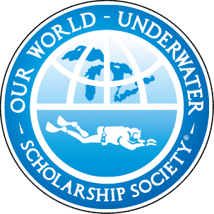
    </a>
    <a class="heritage-logos__item" href="https://www.rolex.org/" target="_blank" rel="noopener">
      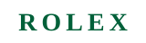
    </a>
  </div>
</div>
```
:::
:::

::: {.section .section--surface}
::: {.section__inner .section__inner--narrow}
[The Rolex Scholar]{.eyebrow}

<h2 class="section__title">A year to travel in your field</h2>

<div class="section__lead">
Internationally, the experience was known as the Rolex Scholar. Each scholar received sponsored equipment, networks and funds for a year-long period to travel in their field — and an engraved Rolex Submariner on top of that support.

Typical pathways included marine science lab exchanges; scuba diving qualifications with any certification agency; internships with photographers, videographers, expedition companies and leaders in marine science; maritime training (national and international courses); and many other placements shaped around each scholar’s goals.

The model was built on trust, curiosity and extraordinary generosity from partners across the underwater world.
</div>
:::
:::

::: {.section}
::: {.section__inner .section__inner--narrow}
[Today]{.eyebrow}

<h2 class="section__title">The Upwelling Project</h2>

<div class="section__lead">
The Upwelling Project is now managed and run by various previous Rolex and OWUSS scholars who lived that experience — and who want to give back to the community and empower others with similar opportunities across Oceania.

We are writing a new chapter: direct funding, recipient-led plans, and a continued focus on practical pathways into marine work — while honouring the people and organisations who made the OWUSS story possible.
</div>
:::
:::

::: {.section .section--surface}
::: {.section__inner}
[Partners in the legacy]{.eyebrow}

<h2 class="section__title">OWUSS &amp; Rolex</h2>

<p class="section__lead">For five decades, Rolex’s partnership with OWUSS defined the Rolex Scholar experience worldwide — including the Australasian program — until that continuous support concluded in 2024. We remain grateful for a legacy of exploration, excellence and investment in underwater leadership.</p>

<p class="section__lead" style="margin-top: 1.5rem">Explore scholar stories from Australasia on <a href="https://owussaustralasia.org/">OWUSS Australasia</a> — the blog where past regional scholars documented training, expeditions and career pathways.</p>
:::
:::

::: {.section .section--sand}
::: {.section__inner}
[Thank you]{.eyebrow}

<h2 class="section__title">Previous Australasian sponsors &amp; supporters</h2>

<p class="section__lead">The Australasian OWUSS program benefited from extraordinary generosity across the dive industry, research community and expedition world. We are deeply grateful to every organisation and individual who contributed time, equipment, training, travel and expertise.</p>

<p class="section__lead">The Upwelling Project hopes to build the future with these partners again — and alongside new sponsors who share our commitment to ocean people and practical marine careers.</p>

```{=html}
<div class="sponsors-grid">
  <a class="sponsor-card" href="https://www.tabata.com.au/" target="_blank" rel="noopener">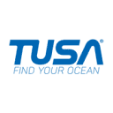<span>Tabata Australia</span></a>
  <a class="sponsor-card" href="https://www.tusa.com/" target="_blank" rel="noopener">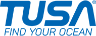<span>Tusa</span></a>
  <a class="sponsor-card" href="https://www.waterproof.eu/" target="_blank" rel="noopener">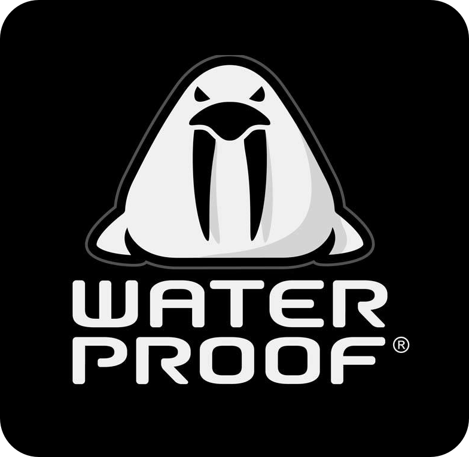<span>Waterproof</span></a>
  <a class="sponsor-card" href="https://www.fourthelement.com/" target="_blank" rel="noopener">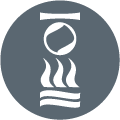<span>Fourth Element</span></a>
  <a class="sponsor-card" href="https://www.padi.com/" target="_blank" rel="noopener">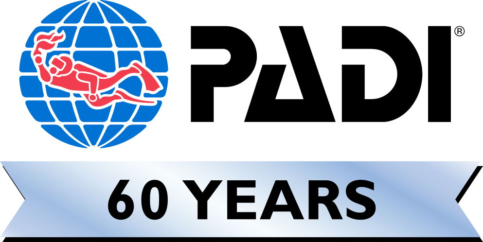<span>PADI</span></a>
  <a class="sponsor-card" href="https://www.gue.com/" target="_blank" rel="noopener">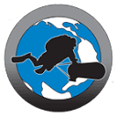<span>GUE</span></a>
  <a class="sponsor-card" href="https://www.divessi.com/" target="_blank" rel="noopener">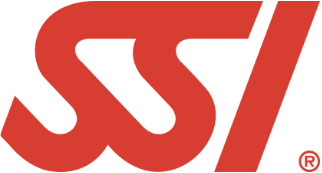<span>SSI</span></a>
  <a class="sponsor-card" href="https://www.tdisdi.com/" target="_blank" rel="noopener"><span>SDI</span></a>
  <a class="sponsor-card" href="https://www.tdisdi.com/" target="_blank" rel="noopener">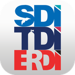<span>TDI</span></a>
  <a class="sponsor-card" href="https://www.galapagossky.com/" target="_blank" rel="noopener">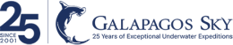<span>Galapagos Sky</span></a>
  <a class="sponsor-card" href="https://www.manlydivecentre.com.au/" target="_blank" rel="noopener"><span class="sponsor-card__name">Manly Dive Centre</span></a>
  <a class="sponsor-card" href="https://www.divebondi.com.au/" target="_blank" rel="noopener">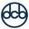<span>Bondi Dive Centre</span></a>
  <a class="sponsor-card" href="https://www.prodive.com.au/" target="_blank" rel="noopener">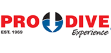<span>Prodive Sydney</span></a>
  <a class="sponsor-card" href="https://www.rodneyfox.com.au/" target="_blank" rel="noopener">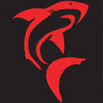<span>Rodney Fox Shark Expeditions</span></a>
  <a class="sponsor-card" href="https://www.reeflifesurvey.com/" target="_blank" rel="noopener">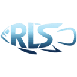<span>Reef Life Survey</span></a>
  <a class="sponsor-card" href="https://www.scottportelli.com/" target="_blank" rel="noopener">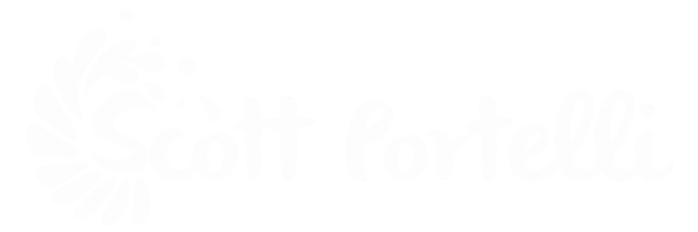<span>Scott Portelli Expeditions</span></a>
</div>
```

<p class="section__lead" style="margin-top: 2rem">Logos are shown with thanks; all trademarks belong to their respective owners. If we have mis-credited or missed a past supporter, please <a href="contact.html">get in touch</a> so we can acknowledge them.</p>
:::
:::

::: {.section .section--deep}
::: {.section__inner .section__inner--narrow}
[Build with us]{.eyebrow}

<h2 class="section__title">Interested in sponsoring The Upwelling Project?</h2>

<p class="section__lead">We are exploring partnerships with organisations and individuals who can help emerging ocean leaders through the marine realm — training, equipment, travel, field opportunities, research access, mentoring, or other in-kind support.</p>

<p class="section__lead">If you have an idea, large or small, we would love to hear from you. Every contribution helps strengthen Oceania’s pipeline of capable, connected ocean professionals.</p>

<p style="margin-top: 30px">[Start a conversation](contact.qmd){.btn-light}</p>
:::
:::
