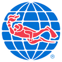

::: {.page-hero}
::: {.page-hero__inner}
[History & heritage]{.eyebrow}

# From OWUSS Australasia to The Upwelling Project

<p>Our story begins with decades of experience-based scholarships, scholar journeys, and partners who helped make them possible.</p>
:::
:::

::: {.section}
::: {.section__inner .section__inner--narrow}
[Our World-Underwater Scholarship Society]{.eyebrow}

<h2 class="section__title">A legacy of underwater leadership</h2>

<div class="section__lead">
The [Our World-Underwater Scholarship Society (OWUSS)](https://www.owuscholarship.org/) was founded in 1974 to foster the next generation of leaders in aquatic and marine fields through experience-based scholarships and internships.

The Australasian arm of OWUSS has long supported emerging talent across Oceania — connecting scholars with training, field work, mentors and sponsors. For many years, Australasian scholars shared that journey publicly on [OWUSS Australasia](https://owussaustralasia.org/), building a rich archive of blogs and reflections from the region.

The Upwelling Project grows directly from that heritage. We are writing a new chapter for Oceania: direct funding, recipient-led plans, and a continued focus on practical pathways into marine work — while honouring the people and organisations who made the OWUSS story possible.
</div>
:::
:::

::: {.section .section--surface}
::: {.section__inner}
[Partners in the legacy]{.eyebrow}

<h2 class="section__title">OWUSS &amp; Rolex</h2>

<p class="section__lead">The Our World-Underwater Scholarship Society is closely associated with long-standing support from Rolex, whose commitment to exploration and excellence has helped sustain the Society’s mission internationally.</p>

```{=html}
<div class="heritage-logos">
  <a class="heritage-logos__item" href="https://www.owuscholarship.org/" target="_blank" rel="noopener">
    
    <span>owuscholarship.org</span>
  </a>
  <a class="heritage-logos__item" href="https://www.rolex.org/" target="_blank" rel="noopener">
    
    <span>rolex.org</span>
  </a>
</div>
```

<p class="section__lead" style="margin-top: 2rem">Explore scholar stories from Australasia on <a href="https://owussaustralasia.org/">OWUSS Australasia</a> — the blog where past regional scholars documented training, expeditions and career pathways.</p>
:::
:::

::: {.section .section--sand}
::: {.section__inner}
[Thank you]{.eyebrow}

<h2 class="section__title">Previous Australasian sponsors &amp; supporters</h2>

<p class="section__lead">The Australasian OWUSS program benefited from extraordinary generosity across the dive industry, research community and expedition world. We are deeply grateful to every organisation and individual who contributed time, equipment, training, travel and expertise.</p>

<p class="section__lead">The Upwelling Project hopes to build the future <strong>with</strong> these partners again — and alongside new sponsors who share our commitment to ocean people and practical marine careers.</p>

```{=html}
<div class="sponsors-grid">
  <a class="sponsor-card" href="https://www.tabata.com.au/" target="_blank" rel="noopener"><span>Tabata Australia</span></a>
  <a class="sponsor-card" href="https://www.tusa.com/" target="_blank" rel="noopener"><span>Tusa</span></a>
  <a class="sponsor-card" href="https://www.waterproof.eu/" target="_blank" rel="noopener"><span class="sponsor-card__name">Waterproof</span></a>
  <a class="sponsor-card" href="https://www.fourthelement.com/" target="_blank" rel="noopener"><span>Fourth Element</span></a>
  <a class="sponsor-card" href="https://www.padi.com/" target="_blank" rel="noopener"><span>PADI</span></a>
  <a class="sponsor-card" href="https://www.gue.com/" target="_blank" rel="noopener"><span>GUE</span></a>
  <a class="sponsor-card" href="https://www.divessi.com/" target="_blank" rel="noopener"><span class="sponsor-card__name">SSI</span></a>
  <a class="sponsor-card" href="https://www.tdisdi.com/" target="_blank" rel="noopener"><span>SDI</span></a>
  <a class="sponsor-card" href="https://www.tdisdi.com/" target="_blank" rel="noopener"><span>TDI</span></a>
  <a class="sponsor-card" href="https://www.galapagossky.com/" target="_blank" rel="noopener"><span>Galapagos Sky</span></a>
  <a class="sponsor-card" href="https://www.manlydivecentre.com.au/" target="_blank" rel="noopener"><span class="sponsor-card__name">Manly Dive Centre</span></a>
  <a class="sponsor-card" href="https://www.divebondi.com.au/" target="_blank" rel="noopener"><span>Bondi Dive Centre</span></a>
  <a class="sponsor-card" href="https://www.prodive.com.au/" target="_blank" rel="noopener"><span>Prodive Sydney</span></a>
  <a class="sponsor-card" href="https://www.rodneyfox.com.au/" target="_blank" rel="noopener"><span>Rodney Fox Shark Expeditions</span></a>
  <a class="sponsor-card" href="https://www.reeflifesurvey.com/" target="_blank" rel="noopener"><span>Reef Life Survey</span></a>
  <a class="sponsor-card" href="https://www.scottportelli.com/" target="_blank" rel="noopener"><span>Scott Portelli Expeditions</span></a>
</div>
```

<p class="section__lead" style="margin-top: 2rem">Logos are shown with thanks; all trademarks belong to their respective owners. If we have mis-credited or missed a past supporter, please <a href="contact.html">get in touch</a> so we can acknowledge them.</p>
:::
:::

::: {.section .section--deep}
::: {.section__inner .section__inner--narrow}
[Build with us]{.eyebrow}

<h2 class="section__title">Interested in sponsoring The Upwelling Project?</h2>

<p class="section__lead">We are exploring partnerships with organisations and individuals who can help emerging ocean leaders through the marine realm — training, equipment, travel, field opportunities, research access, mentoring, or other in-kind support.</p>

<p class="section__lead">If you have an idea, large or small, we would love to hear from you. Every contribution helps strengthen Oceania’s pipeline of capable, connected ocean professionals.</p>

<p style="margin-top: 30px">[Start a conversation](contact.qmd){.btn-light}</p>
:::
:::
